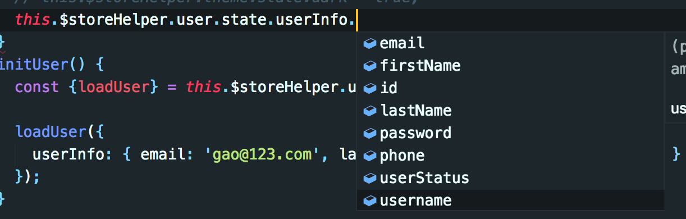
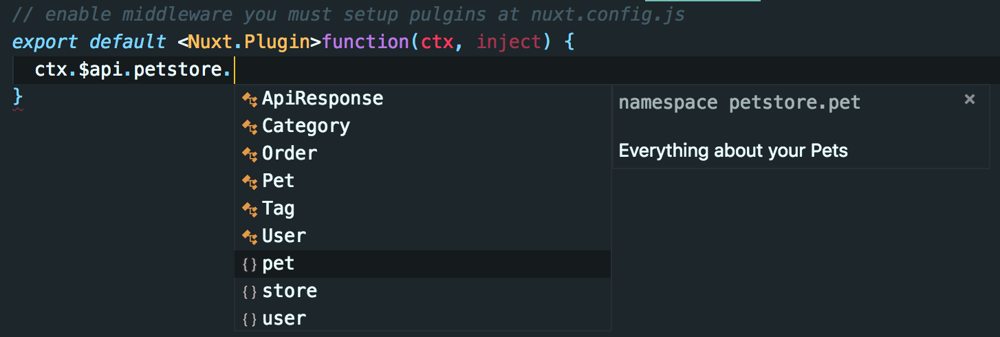

# nuxt-ts-pont-demo


## 目录说明

```
app
├── api                             api 生成目录
│   ├── api.d.ts                        ├── API全局命名声明
│   ├── api.lock
│   ├── index.ts
│   └── petstore
├── assets                          资源目录 css,img 参于编译
│   └── css
├── components                      组件目录
│   └── README.md
├── config                          配置目录
│   ├── menu.config.ts                  ├── 菜单配置
│   ├── pont-config.json                ├── pont 配置文件
│   ├── pont-template-nuxt.ts           ├── pont 自定义代码模板
│   └── proxy.config.js                 └── 代理配置
├── layouts                         页面布局组件目录
│   └── default.vue                     └── 默认布局组件
├── libs                            公共库目录
│   └── fetch.ts                        └── axios封装函数
├── middleware                      中间件目录
│   └── auth.ts                         └── 鉴权中间件
├── modules                         模块目录，扩展nuxt核心功能
│   └── typescript.js                   └── typescript模块扩展nuxt
├── pages                           页面组件目录
│   ├── index.vue                       ├── 首页
│   └── login.vue                       └── 登陆页
├── plugins                         插件目录
│   ├── apiInject.ts                    ├── api注入插件
│   ├── storeHelper.ts                  ├── storeHelper注入插件
│   └── vuetify.ts                      └── vuetify plugin
├── static                          静态资源目录,不参与编译，编译时只拷贝到输出目录
└── store
    ├── channel.ts
    ├── index.ts
    └── product.ts
```

## 配置

### pont-config.json

> 提示
> `pont` 配置文件 `pont-config.json` 及代码生成模板 `pont-template-nuxt` 位于 app/config 文件夹,`pont`执行时会自动递归搜索项目文件夹中的 `pont-config.json`

采用多源目录节构 **usingMultipleOrigins: true**

```json
{
  "outDir": "../api",
  "origins": [
    {
      "originUrl": "https://petstore.swagger.io/v2/swagger.json",
      "name": "petstore",
      "usingMultipleOrigins": true
    },
    {
      "originUrl": "https://petstore.swagger.io/v2/swagger.json",
      "name": "petstore2",
      "usingMultipleOrigins": true
    }
  ],
  "templatePath": "./pont-template-nuxt"
}
```

### [pont-template-nuxt.ts](app/config/pont-template-nuxt.ts) 自定义代码生成模板

根据项目特点，对标准模板作出如下修改

- **api/api.d.ts**
  - 以 UMD 模块形式只导出一个全局命名空间 `API`
- **api/petstore/api.d.ts**
  - 将 declare namespace 更改为 export namespace
  - 删除 `defs` 空间，避免因`export namespace` 而导致在多源情况下导出多个 `defs` 和 `API`的问题
- **`api/index.ts`**
  - 将 `window.API` 更改为 `export const API`
  - 删除 defs
- **`api/petstore/mods/*/*.ts`**
  - 目标源名称作为前辍合并到接口`url`中，代理时根据前辍进行代理配置

### proxy.config.ts

代理配置需根据 ajax 请求的**url 前辍**(`源名称`), 配置 **target** 与 **pathrewrite**

```ts
// 代理配置
// 参考 https://github.com/nuxt-community/proxy-module
// 参考 https://github.com/chimurai/http-proxy-middleware
export default {
  '/petstore': {
    target: 'https://petstore.swagger.io',

    // http-proxy-events handle
    // https://github.com/chimurai/http-proxy-middleware#http-proxy-events
    onProxyReq(proxyReq, req, res) {
      // proxyReq.setHeader('Authorization', global.__BearerToken__)
    },
    pathRewrite: {
      '^/petstore/': '/v2/'
    }
  }
};
```

### menu.config.ts

## 插件

### plugins/apiInject.ts

自动将`app/api`注入到 nuxt 上下文, vue 原型及 store，通过 \$api 可以直接调用 api

### plugin/storeHelper.ts

vuex 插件扩展，快速调用 `action` 和 `mutation`， 具有良好的智能提醒及类型安全。`$storeHelper` 注入到 nuxt 上下文, vue 原型。

> 提示： vscode 插件市场搜索 storehelper 安装插件，可以自动生成类型定义文件。https://github.com/gaoletian/storeHelper-vscode

用法：

```ts
// action
this.$storeHelper.home.action.getPets(payload);
// 等同于
this.$store.dispatch('home/getPets', payload);

// mutation
this.$storeHelper.theme.mutation.setDark();
// 等同于
this.$store.commit('theme/setDark');

// getter
this.$storeHelper.user.getter.email;
// 等同于
this.$store.getters['user/email'];

// state
this.$storeHelper.user.state.userInfo
this.$storeHelper.demo_cache.state.foo
// 等同于
this.$store.state.user.userInfo
this.$store.state.demo.user.foo


// 名字空间嵌套
this.$storeHelper.demo_cache.mutation.clear()
// 等同于
this.$store.commit('demo/cache/clear');

```



## 用法举例

### 自定义 Nuxt 插件

```ts
// enable middleware you must setup pulgins at nuxt.config.js
export default <Nuxt.Plugin>function(ctx, inject) {
  let pet = await ctx.$api.petstore.pet.getPetById.request({ petId: 1 });
  console.log(pet.name);
};
```

### 自定义 Nuxt 中间件

```ts
// enable middleware you must setup router's middleware at nuxt.config.js or app/pages/*.vue
export default <Nuxt.MiddleWare>function(ctx) {
  let pet = await ctx.$api.petstore.pet.getPetById.request({ petId: 1 });
  console.log(pet.name);
};
```

### nuxtServerInit

```ts
// app/store/index.ts

async nuxtServerInit({ commit }, ctx: Nuxt.Context) {
  let pet = await ctx.$api.petstore.pet.getPetById.request({petId: 1});
  console.log(pet.name)
}
```

### page 页面组件中

```ts
import { Component, Vue } from 'nuxt-property-decorator';
import { Catch } from '~/libs/decorators';

@Component({
  layout: 'console',
  name: 'login-page',
  auth: false
})
export default class extends Vue {
  @Catch((ctx, err) => console.log(err))
  async Login() {
    const res = await this.$api.petstore.user.loginUser.request({ username: 'foo', password: 'bar' });
    console.log(res);
  }
}
```


